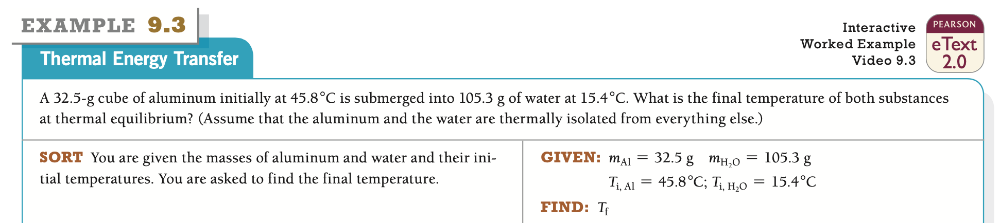

chemchem
================

<!-- WARNING: THIS FILE WAS AUTOGENERATED! DO NOT EDIT! -->

This file will become your README and also the index of your
documentation.

## Install

``` sh
pip install chemchem
```

### Thermochemistry



``` python
Al = Compound('Al')
```

``` python
Al.get_amounts(grams=32.5)
```

    {'grams': 32.5, 'molecules': 7.251130383218443e+23, 'moles': 1.204506708175821}

``` python
#Al.properties
```

``` python
H2O = Compound('H2O')
```
